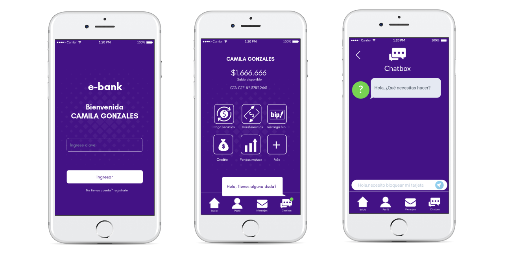
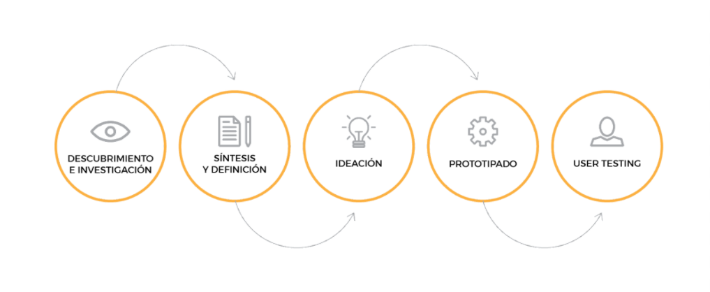
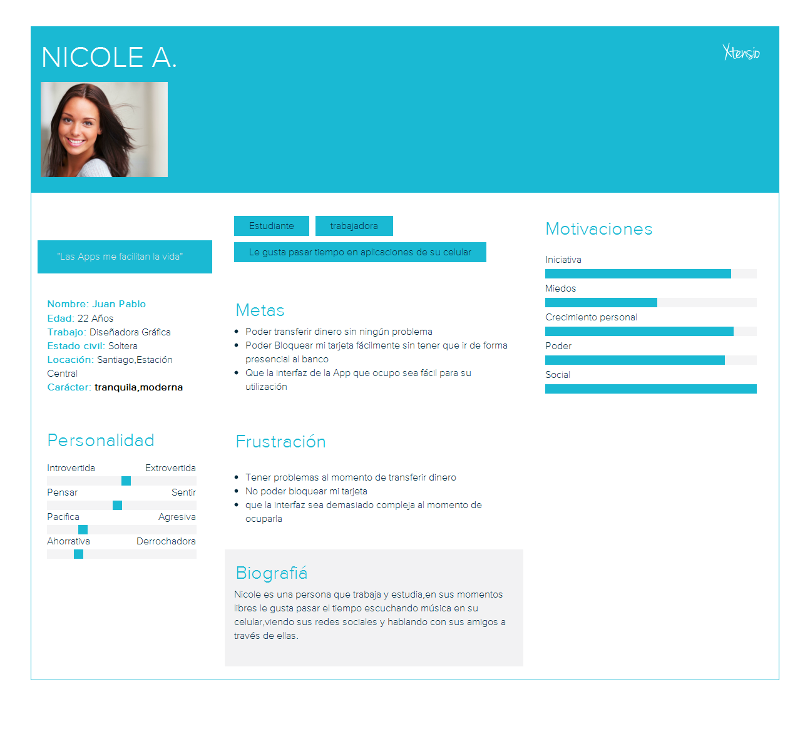

# e-bank

E-bank es una aplicación de banco orientada a un publico millenials, cuya característica principal es la transparencia y el contacto directo con el usuario, quien quiere la información inmediata de lo que necesita.

## Nuestro proceso de diseño

## Descubrimiento e Investigación

### User Research:
#### Entrevistas
Realizamos entrevistas a 10 usuarios con edades entre 20 a 30 años que constituían la generación de millenials.

## Sintesis y Definición
### Problem Statement
Nos guiamos en estos diferentes puntos para definir el problema:

* El Usuario no quería ir a hacer filas al banco ya que pierde tiempo y siempre está lleno
* El Usuario quería una interfaz que fuera fácil para su utilización
* El Usuario quería una opción que evitara el tener que estar llamando por teléfono
* El Usuario quería algo que le facilitara el no estar saliendo a su correo para ver las
  notificaciones que les llegan al correo 
* El Usuario necesitaba ver su saldo al momento de ingresar al home 
* El Usuario quiere una interfaz que sea rápida para hacer sus transacciones 

### HMW (¿Cómo podríamos?)

* Cómo podríamos hacer que los usuarios evitarán llamar por teléfono para resolver sus 
  problemas
* Cómo podríamos hacer una interfaz rápida y intuitiva para el usuario
* Cómo podríamos solucionar los problemas de los usuarios fácilmente sin que vayan al 
  banco a hacer largas filas

### What if? (¿Y si?)

* ¿Y si existiera un chat en donde los usuarios pudieran hacer todas sus consultas sin la 
  necesidad de estar llamando por teléfono? 
* ¿Y si nuestra interfaz fuera intuitiva para el usuario para poder hacer sus 
  transacciones,pagar cuentas,ver su crédito etc?
* ¿Y si las notificaciones llegarán directamente directamente a una sección de correo sin 
  tener que abrir tu correo externamente? 
* ¿Y si el saldo estuviera siempre en la home para que el usuario siempre estuviera 
  viendo su saldo disponible? 

### User Persona

## Ideación

Decidimos enfocarnos en usuarios cuyo principal problema era resolver dudas sin llegar a la línea telefónica o ir al banco de manera presencial, por lo que implementamos un chatbox de ayuda permanente para la resolución de problemas y además para mantenerlos cautivos dentro de la aplicación creamos la sección de mensajes directos, donde llegan notificaciones cuando haya algun movimiento relacionado con los productos del banco, creando una interfaz intuitiva para realizar acciones directas dentro de la propia aplicación.

### Customer Journey Map

## Prototipado

Se Puede ver el prototipo de la aplicación [aqui](https://marvelapp.com/30abhhd).

## User Testing

Realizamos un testeo a alrededor de 7 personas y fuimos corrigiendo lo siguiente:

* Hacer la transición más amigable cuando se realizan los cambios de pantalla
* Poder volver atrás cuando estas realizando alguna acción dentro de la aplicación
* Aumentar el tiempo de las vistas splash para que se pueda leer
* Generar mayores señas para que el usuario clickeara la sección del chatbox.

